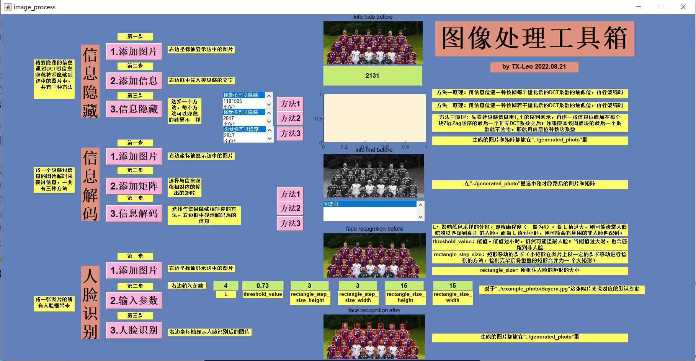
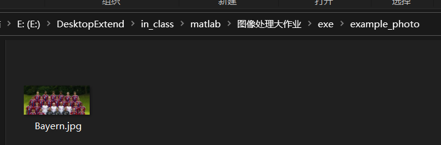
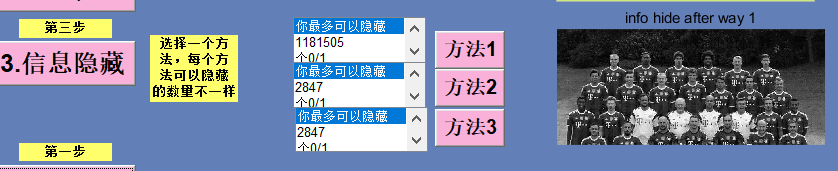
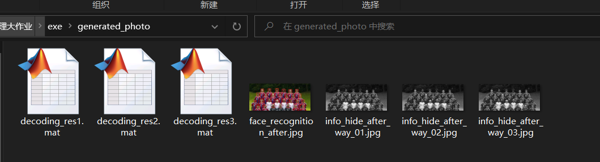
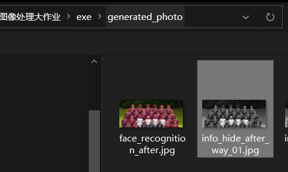
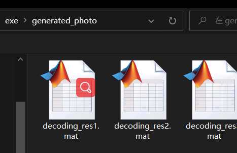
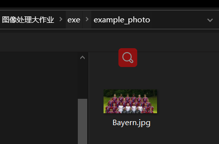
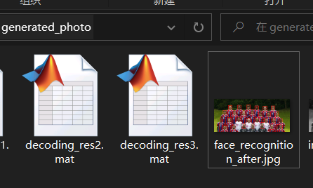

# 重要
不要改变文件结构！！，.exe文件在exe里，生成的图片及.mat在generated_photo里，一张典例图片在example_photo里，image里是一些README文档需要的照片，resource里的是一些依赖文件，不要动！
## 目录

*   [CH](#ch)

    *   [功能介绍  ](#功能介绍--)

        *   [1.信息隐藏](#1信息隐藏)

        *   [2.信息解码](#2信息解码)

        *   [3.人脸识别](#3人脸识别)

    *   [使用方法](#使用方法)

        *   [1.信息隐藏](#1信息隐藏-1)

            *   [1）添加照片](#1添加照片)

            *   [2）添加信息](#2添加信息)

            *   [3）信息隐藏](#3信息隐藏)

        *   [2.信息解码](#2信息解码-1)

            *   [1）添加图片](#1添加图片)

            *   [2）添加矩阵](#2添加矩阵)

            *   [3）信息解码](#3信息解码)

    *   [3.人脸识别](#3人脸识别-1)

        *   [1）添加图片](#1添加图片-1)

        *   [2）输入参数](#2输入参数)

        *   [3）人脸识别](#3人脸识别-2)

*   [ENG](#eng)

    *   [Prerequisites for Deployment ](#prerequisites-for-deployment-)

    *   [Files to Package for Standalone](#files-to-package-for-standalone)

    *   [Definitions](#definitions)

# README.md-image process

# CH

图像处理工具箱 .exe &#x20;

Author：TX-Leo

Data:2022.08.21

***

## 功能介绍 &#x20;

### 1.信息隐藏

将要隐藏的信息通过DCT域信息隐藏技术隐藏到选中的图片中，一共有三种方法

*   方法一原理：用信息位逐一替换掉每个量化后的DCT系数的最低位，再行熵编码

*   方法二原理：用信息位逐一替换掉若干量化后的DCT系数的最低位，再行熵编码

*   方法三原理：先将待隐藏信息用1,-1 的序列表示，再逐一将信息位追加在每个块Zig-Zag顺序的最后一个非零DCT系数之后；如果原本该图像块的最后一个系数就不为零，那就用信息位替换该系数

### 2.信息解码

将一个隐藏过信息的图片解码来获得信息，一共有三种方法

### 3.人脸识别

将一张图片的所有人脸框出来

***

## 使用方法

### 1.信息隐藏

#### 1）添加照片

添加照片的例子： &#x20;

`example_photo/Bayern.jpg`

&#x20;

#### 2）添加信息

#### 3）信息隐藏

三种方法（点击 方法1/2/3)

等待一会后：

会生成一个照片.jpg和矩阵.mat在generated\_photo里

***

### 2.信息解码

#### 1）添加图片

添加音乐表格的例子：

`generated_photo/info_hide_after_way_01.jpg`

#### 2）添加矩阵

#### 3）信息解码

选择与矩阵对应的方法

***

## 3.人脸识别

### 1）添加图片

### 2）输入参数

### 3）人脸识别

***

# ENG

image\_process\_toolbox Executable

## Prerequisites for Deployment&#x20;

Verify that version 9.9 (R2020b) of the MATLAB Runtime is installed.  &#x20;

If not, you can run the MATLAB Runtime installer.

To find its location, enter

\>>mcrinstaller

at the MATLAB prompt.

NOTE: You will need administrator rights to run the MATLAB Runtime installer.&#x20;

Alternatively, download and install the Windows version of the MATLAB Runtime for R2020b&#x20;

from the following link on the MathWorks website:

[https://www.mathworks.com/products/compiler/mcr/index.html](https://www.mathworks.com/products/compiler/mcr/index.html "https://www.mathworks.com/products/compiler/mcr/index.html")

For more information about the MATLAB Runtime and the MATLAB Runtime installer, see&#x20;

"Distribute Applications" in the MATLAB Compiler documentation &#x20;

in the MathWorks Documentation Center.

1.  Files to Deploy and Package

## Files to Package for Standalone

\-image\_process\_toolbox.exe

\-MCRInstaller.exe&#x20;

Note: if end users are unable to download the MATLAB Runtime using the

instructions in the previous section, include it when building your&#x20;

component by clicking the "Runtime included in package" link in the

Deployment Tool.

\-This readme file&#x20;

## Definitions

For information on deployment terminology, go to

[https://www.mathworks.com/help](https://www.mathworks.com/help "https://www.mathworks.com/help") and select MATLAB Compiler >

Getting Started > About Application Deployment >

Deployment Product Terms in the MathWorks Documentation

Center.
